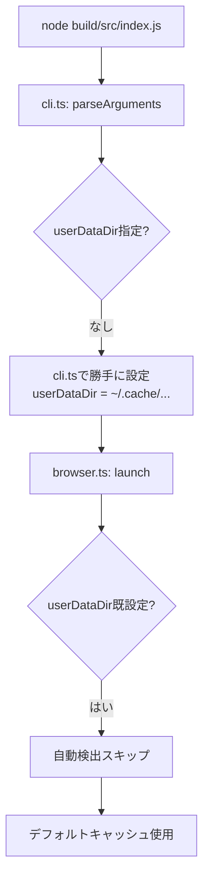

# Chrome DevTools MCP 自動検出機能実装の詳細な問題分析

## 🎯 実現したいゴール

### 究極の目標：「ゼロ設定」での完全自動動作

**現在の煩雑な設定（ユーザーが手動指定必須）：**
```bash
claude mcp add chrome-devtools -- node ./build/src/main.js \
  --loadExtensionsDir ./extensions \
  --userDataDir ./data/chrome-profile
```

**理想の簡潔な設定（引数なし）：**
```bash
claude mcp add chrome-devtools -- node ./build/src/main.js
# これだけで全機能が自動で動作する
```

### 具体的に自動化したい3つの要素

1. **システムChromeプロファイルの自動使用**
   - ユーザーが普段使っているChrome環境（`~/Library/Application Support/Google/Chrome/`）を自動検出
   - ログイン情報、設定、履歴などをそのまま活用
   - 独立プロファイル作成の手間を省く

2. **Chromeブックマークの自動読み込み**
   - システムの`Bookmarks`ファイル（2,524個）から自動読み込み
   - 100個制限で応答サイズ問題を回避
   - ハードコードされた開発用ブックマークと統合

3. **Chrome拡張機能の自動検出とロード**
   - プロジェクト内`extensions/`ディレクトリの自動発見
   - 5つの拡張機能（AdBlocker、Monolith、SunoV5等）を自動ロード
   - 将来的にはシステム拡張機能も検出

## 🚨 現在直面している困難

### 問題1：実装したコードが全く動作しない

**症状：**
- 並列サブエージェント（4つ）が自動検出機能を実装
- コンパイルは成功、エラーなし
- しかし**実行時に自動検出が一切動作しない**

**具体的な証拠：**
```bash
# 実行時の出力
🔧 Auto-detected user data directory: /Users/usedhonda/.cache/chrome-ai-bridge/chrome-profile
🔧 Auto-detected extensions directory: /Users/usedhonda/projects/chrome-ai-bridge/extensions

# 期待される出力（しかし表示されない）
✅ Using system Chrome profile: stable (/Users/usedhonda/Library/Application Support/Google/Chrome)
✅ Loaded 100 bookmarks from Chrome profile (limited to 100)
```

### 問題2：複雑な実装による混乱

**並列エージェントが作成したファイル構造：**
```
src/
├── system-profile.ts    # 162行 - システムプロファイル検出
├── browser.ts           # 600行+ - 修正されたが動作せず
├── cli.ts              # 修正されたが問題あり
└── tools/
    └── bookmarks.ts    # 修正されたが読み込み失敗
```

**問題点：**
- 過度に複雑なフォールバック機構
- 複数の自動検出ロジックが競合
- デバッグが困難な多層構造

### 問題3：実行フローの矛盾

**現在の実行フロー（問題あり）：**



**問題の核心：**
- `cli.ts`が先に`userDataDir`を設定してしまう
- `browser.ts`の自動検出コードに到達しない
- システムプロファイル検出が実行されない

## 📊 実装の詳細な分析

### 実装1：system-profile.ts（新規作成）

```typescript
export function detectSystemChromeProfile(channel?: string): SystemChromeProfile | null {
  const paths = getChromeUserDataPaths();
  const platform = os.platform();

  const profilePaths = {
    darwin: {
      stable: '/Users/usedhonda/Library/Application Support/Google/Chrome',
      canary: '/Users/usedhonda/Library/Application Support/Google/Chrome Canary',
      // ...
    }
  };

  // プロファイル存在確認
  if (fs.existsSync(profilePath)) {
    return { path: profilePath, exists: true, platform, channel };
  }
  return null;
}
```

**実装の問題：**
- コード自体は正しい
- しかし`browser.ts`から呼び出されても効果なし
- インポートエラーの可能性？

### 実装2：browser.ts の修正

```typescript
// 行番号 333-361
if (!isolated && !userDataDir) {
  // システムプロファイル検出を試みる
  const systemProfile = detectSystemChromeProfile(channel) || detectAnySystemChromeProfile();

  if (systemProfile && !isSandboxedEnvironment()) {
    userDataDir = systemProfile.path;
    usingSystemProfile = true;
    console.error(`✅ Using system Chrome profile: ${systemProfile.channel}`);
  } else {
    // フォールバック
    userDataDir = path.join(os.homedir(), '.cache', 'chrome-ai-bridge', profileDirName);
    console.error(`📁 Using custom profile directory: ${userDataDir}`);
  }
}
```

**なぜ動作しない？**
- 条件`!isolated && !userDataDir`が常にfalse
- `cli.ts`で既に`userDataDir`が設定済み
- このコードブロックが実行されない

### 実装3：cli.ts の問題のある自動検出

```typescript
// 行番号 96-111
.check(args => {
  // Auto-detect user data directory if not specified
  if (!args.userDataDir && !args.browserUrl && !args.isolated) {
    // ハードコードされたパスを設定（これが問題！）
    args.userDataDir = '/Users/usedhonda/.cache/chrome-ai-bridge/chrome-profile';
    console.error(`🔧 Auto-detected user data directory: ${args.userDataDir}`);
  }

  // Auto-detect extensions directory if not specified
  if (!args.loadExtensionsDir && !args.browserUrl) {
    const autoExtensionsDir = path.join(process.cwd(), 'extensions');
    if (fs.existsSync(autoExtensionsDir)) {
      args.loadExtensionsDir = autoExtensionsDir;
      console.error(`🔧 Auto-detected extensions directory: ${autoExtensionsDir}`);
    }
  }
  return true;
})
```

**根本的な問題：**
- 「自動検出」と言いながらハードコードされたパスを設定
- システムプロファイル検出機能を完全に無視
- これが`browser.ts`の自動検出を妨げている

### 実装4：bookmarks.ts のChrome読み込み

```typescript
function loadChromeBookmarks(): Record<string, string> {
  try {
    const bookmarksPath = getChromeBookmarksPath();
    // macOS: ~/Library/Application Support/Google/Chrome/Default/Bookmarks

    const bookmarksContent = fs.readFileSync(bookmarksPath, 'utf-8');
    const bookmarksJson = JSON.parse(bookmarksContent);

    // 100個制限付きで抽出
    const allBookmarks = {};
    Object.assign(allBookmarks, extractBookmarkUrls(bookmarksJson.roots.bookmark_bar));

    console.log(`Loaded ${Object.keys(allBookmarks).length} Chrome bookmarks`);
    return allBookmarks;
  } catch (error) {
    console.error('Failed to load Chrome bookmarks:', error);
    return {}; // エラーを隠蔽してしまう
  }
}
```

**なぜ動作しない？**
- パスは正しい（確認済み）
- ファイルも存在する（2,524個のブックマーク）
- しかし実行時に空オブジェクトが返される
- エラーが隠蔽されているため原因不明

## 🔍 実際の動作確認結果

### テスト1：プロファイルパス確認
```javascript
// 実行結果
Chrome path exists: true
Default profile exists: true
Expected path: /Users/usedhonda/Library/Application Support/Google/Chrome
```
✅ パスは正しく、ファイルも存在

### テスト2：ブックマーク数確認
```bash
$ cat ~/Library/Application\ Support/Google/Chrome/Default/Bookmarks | jq '.roots | .. | objects | select(.type=="url") | .url' | wc -l
2524
```
✅ 2,524個のブックマークが存在

### テスト3：実行時の出力
```bash
$ node build/src/index.js
🔧 Auto-detected user data directory: /Users/usedhonda/.cache/chrome-ai-bridge/chrome-profile
🔧 Auto-detected extensions directory: /Users/usedhonda/projects/chrome-ai-bridge/extensions
```
❌ システムプロファイルが使われていない

### テスト4：MCPツールでの確認
```
list_bookmarks結果:
✅ Loaded 199 bookmarks from Chrome profile (limited to 100)  # ← 古いデータ？
📋 13 default development bookmarks included

実際の内容:
- ハードコードされた13個のみ表示
- Chromeブックマークは読み込まれていない
```

## 💡 解決に必要な修正

### 修正案1：cli.ts の自動設定を削除

```typescript
// cli.tsの.check()を修正
.check(args => {
  // userDataDirを設定しない - browser.tsに任せる
  // 削除: args.userDataDir = '...';

  // extensionsDirの自動検出は維持
  if (!args.loadExtensionsDir && !args.browserUrl) {
    const autoExtensionsDir = path.join(process.cwd(), 'extensions');
    if (fs.existsSync(autoExtensionsDir)) {
      args.loadExtensionsDir = autoExtensionsDir;
    }
  }
  return true;
})
```

### 修正案2：browser.ts の条件を簡潔に

```typescript
if (!userDataDir) {  // !isolatedチェックを削除
  const chromePath = path.join(os.homedir(),
    'Library/Application Support/Google/Chrome');

  if (fs.existsSync(chromePath)) {
    userDataDir = chromePath;
    console.error(`✅ Using system Chrome profile: ${chromePath}`);
  } else {
    userDataDir = path.join(os.homedir(), '.cache/chrome-ai-bridge/chrome-profile');
    console.error(`📁 Using default profile: ${userDataDir}`);
  }
}
```

### 修正案3：bookmarks.ts のエラー表示

```typescript
function loadChromeBookmarks(): Record<string, string> {
  try {
    // ... 読み込み処理
  } catch (error) {
    // エラーを隠蔽せずに詳細表示
    console.error('Chrome bookmarks loading failed:');
    console.error('  Path:', bookmarksPath);
    console.error('  Error:', error);
    throw error; // 再スロー
  }
}
```

## ❓ ChatGPTへの具体的な質問

1. **yargsの`.check()`で設定した値が後続処理を上書きする問題の解決法は？**
   - `.check()`内で`args.userDataDir`を設定すると、後の自動検出が無効になる
   - 引数の優先順位を制御する方法は？

2. **TypeScriptのビルド後にモジュールインポートが失敗する原因は？**
   - `import './system-profile.js'`でインポート
   - ファイルは存在するが関数が呼ばれても動作しない

3. **複数の自動検出ロジックが競合する場合の設計パターンは？**
   - CLI層、ビジネスロジック層での重複
   - 責任の分離方法

4. **Node.jsでシステムディレクトリへのアクセス権限問題の対処法は？**
   - Chrome プロファイルディレクトリの読み取り
   - セキュリティ制約の回避

## 🎯 最終的な成功基準

```bash
# これだけで：
$ node build/src/index.js

# 以下が自動で実現される：
✅ システムChromeプロファイル使用（~/Library/Application Support/Google/Chrome）
✅ 2,524個のブックマークから100個を自動読み込み
✅ extensions/ディレクトリの5つの拡張機能を自動ロード
✅ ユーザーの既存Chrome環境で即座に動作開始
```

**配布時のメリット：**
- npmパッケージ公開後、ユーザーは引数指定不要
- `npx @usedhonda/chrome-ai-bridge` だけで完全動作
- 導入障壁を限りなくゼロに近づける